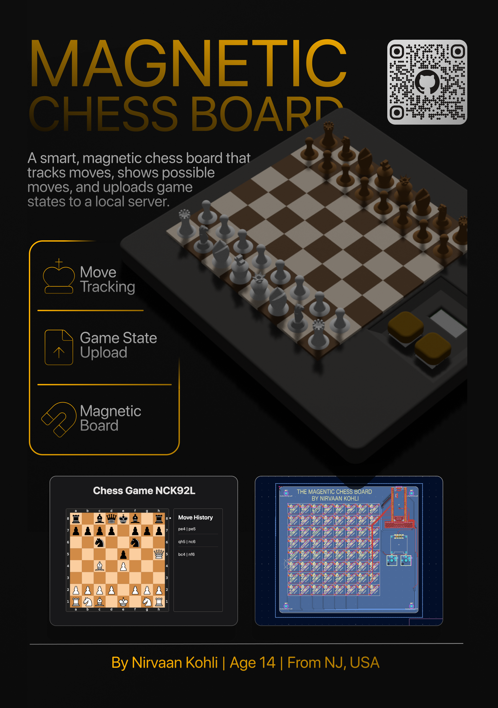
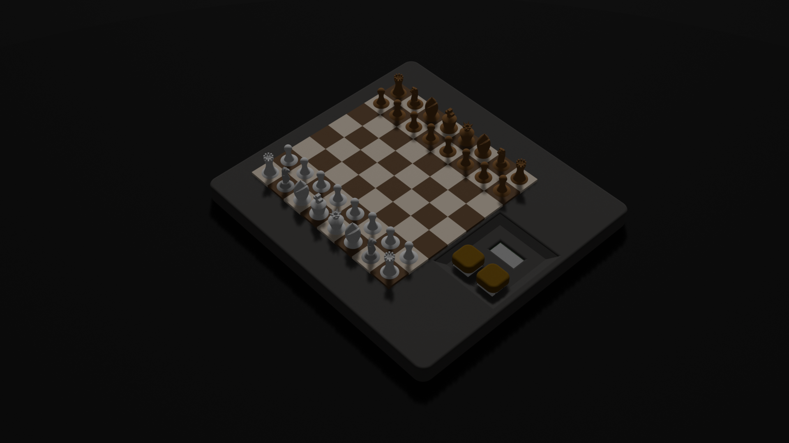
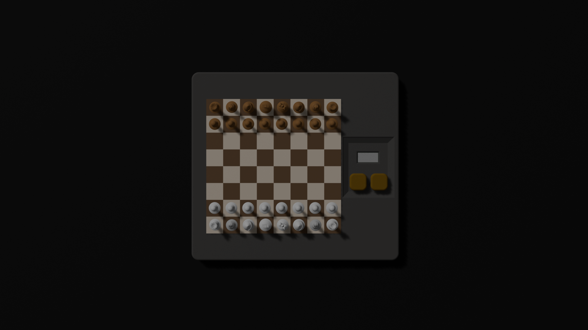
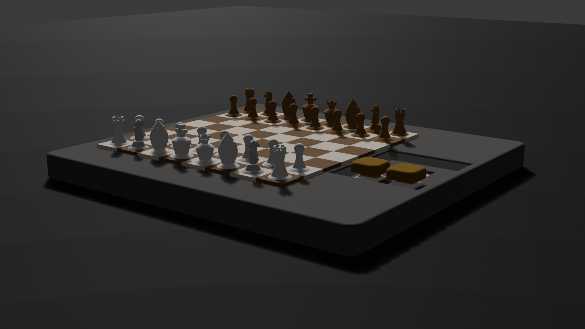
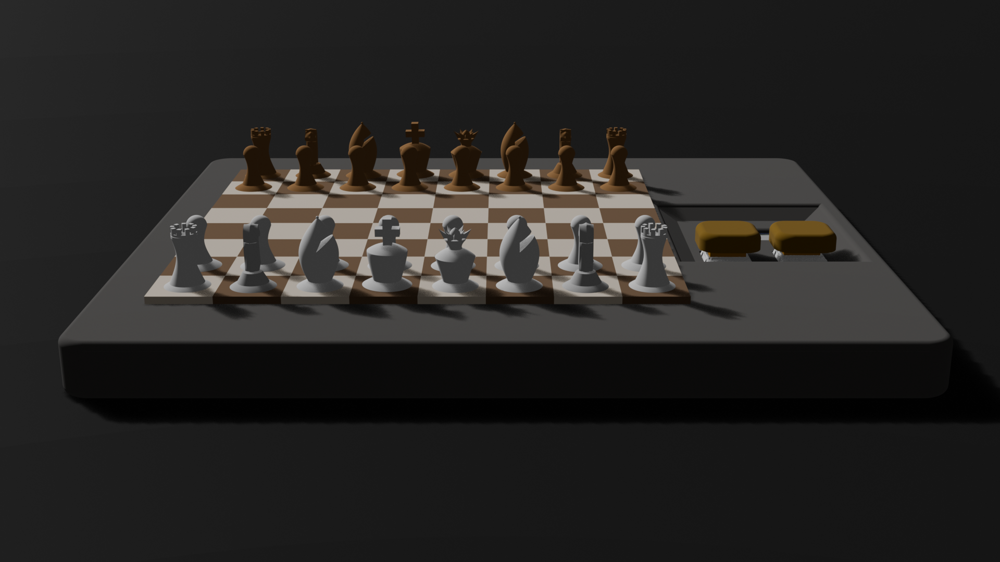
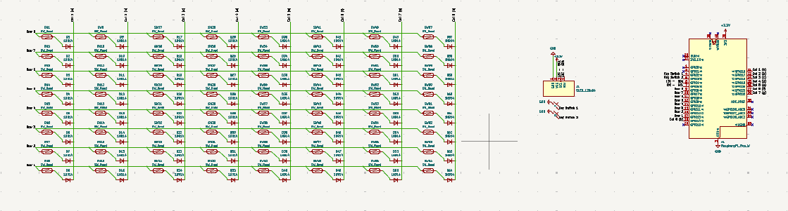
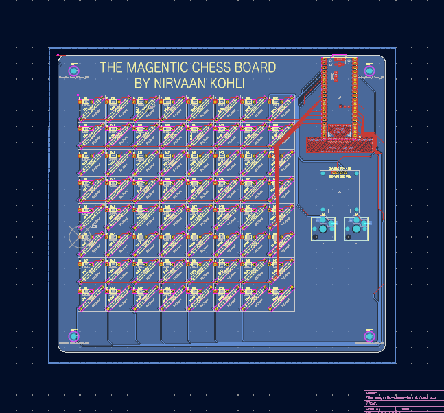
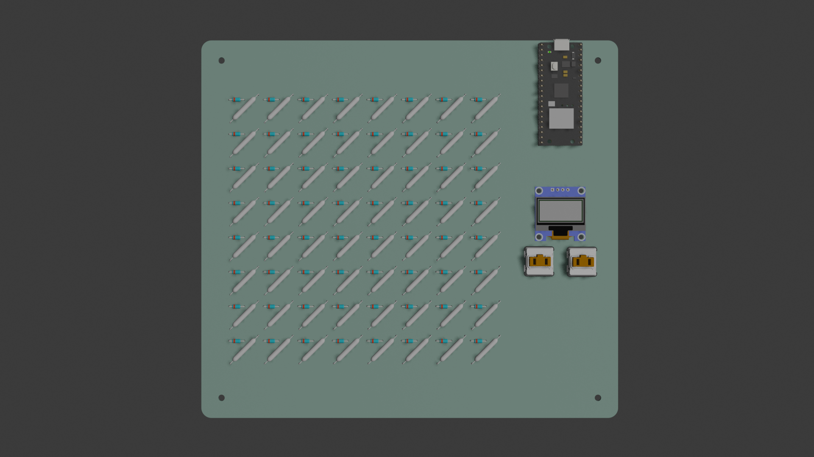
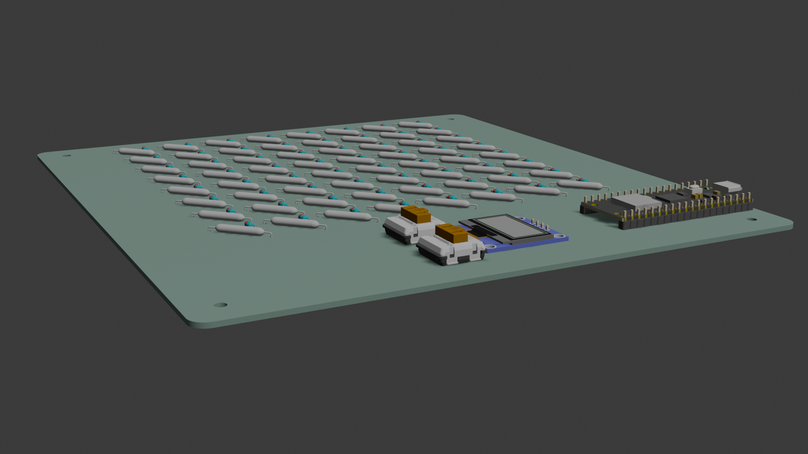
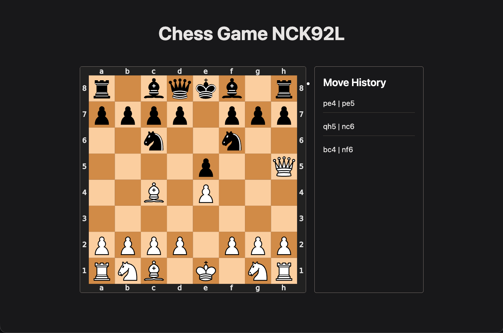

# Magnetic Chess Board





---

## What is this project?

Magnetic Chess Board is a chessboard with electromagnetic sensors, two key switches and an OLED display. It tracks each move you make on the board via electromagnetic sensors(reedswitches) hidden within the board and uploads the game data to a local web server running on your device.

The chessboard itself is powered by a Raspberry Pi Pico W. The board connects wirelessly to your host device and allows you to play physically while having all the benfits of being able to analyze your gameplay later. Games are stored in json & svg format and can also be seen through the web interface on your own device.

---

## Why choose this project?

After creating [MORPH.00](https://github.com/nirvaankohli/MORPH.00/tree/main), a customizable keyboard that changes it's function, I wanted something different. Counsidently my feed showed me a chess board that can move the pieces itself. I orginally wanted to do this because of that video. However, I quickly found out the magic part of moving the pieces autonomously was to expensive. So, I settled for the next best thing, an electromagnetic chess board to analyze and track your moves. It was still such a cool idea because you are turning something physical into something digital. Additionally, let's say your friend comes voer and you play chess, you can expose the endpoint on like a server or something so both of you can look back at the game. Taking all of these things into account, I decided to choose this project. The use of this is legitimate because of the stuff I just mentioned above. 

----

This project is powered by a [Raspberry Pi Pico W](https://www.digikey.com/en/products/detail/raspberry-pi/SC0918/16608263?gclsrc=aw.ds&gad_source=1&gad_campaignid=20243136172&gbraid=0AAAAADrbLljsWjzjlqCOAZTfclDIAHgz4&gclid=Cj0KCQjwrZTRBhDSARIsAHidYfce6rFr-VwDE62IjY7dzyzYrg_4eUx6KZ3DTTBa-lTi34BBF99YXZwaAoAzEALw_wcB) running [MicroPython](https://micropython.org/download/RPI_PICO_W/) with some libraries. This microcontroller is on the top right part of the PCB so the charging port can be exposed and be close to components like the OLED and switches. 

The switches are low profile Choc V1 switches, the OLED a 0.96 Inch 128x64 OLED I2C Display Module, and all the electromagnetic sensors MKA-10110 10X18MM N/O SPST Contact Reed Switches. There is a part of this project on the host computer that hosts the web server that stores all the chess game's states and past move history. 

--- 

## CAD Renderings





My pieces 3D modeling is not the best, ik.

---

## PCB & Schematic






Below, is the PCB w components in multiple views.




Beautiful, right?

---

## Web Page




---

## How it Works

Each square on the board has a reed switch underneath it that detects wether a piece is present. A Raspberry Pi pico W scans all 8 columns and 8 rows of these switches as a key matrix, along with two buttons and an OLED display.

When a piece is moved the Pico W sends the current occupied squares to a local Flask server on the hosts computer(or anywhere). The server compares that physical board state to the saved chess game state(if the game was newly created it spins up a new one) using `python-chess`, finds the legal move that matches, and updates the game history. 

If the move is ambiguous, the OLED shows the possible moves and buttons let the player choose the correct one. After every valid move, the server saves the new board state and updates the web page so the full game can be viewed later.

---

## How To Use

1. Plug in a micro-usb cable into the Pico and the other end into your host computer
2. Install the firmware onto the Pico W(reference [this](code/pico_w/firmware.md) if not sure)
3. Download [the Thonny IDE](https://thonny.org/)
    - Click the bottom-right corner of Thonny and ensure it says MicroPython (Raspberry Pi Pico).
4. Update `code/pico_w/code/secrets.py` with:
    - your Wi-Fi SSID
    - your Wi-Fi password
    - your computer's local server address, like `http://192.168.x.x:5000`
5. In the Thonny Files sidebar, got to the "This computer" section to find the directory `code/pico_w/`. 
6. Right-click all the .py files and select `Upload to` to transfer the files to your pico.
7. Run the host server from `code/host`:
   ```bash
   flask --app app run --debug --host 0.0.0.0
    ```
8. Power on the board and wait for it to connect to WiFi.
9. Hold the white button to start a game(left).
10. Move pieces on the board as usual.
11. The white button confirms the current player's turn.
12. If the board detects multiple possible moves, use the black button to cycle through them and the white button to confirm the correct one.
13. Open the game page in your browser at:
```
http://<your-computer-ip>:5000/game/<game_id>
```
    to view the move history and current board state.

The server saves each game's state in `code/host/game_state/<game_id>.json` and `code/host/game_state/<game_id>.svg`

---

## How to Build/Assemble

Notice: You will need a way to 3D print parts for this

1. Go into `hardware/cad/3d-printed/pieces/` and print all the `.stl` files it contains. Below are which ones to print two times. 
    - Print `rook.stl`, `knight.stl`, and `bishop.stl` 2 times each for both black and white.
    - Then print both `queen.stl` and `king.stl` 1 time each for both black and white.
    - Print `disk.stl`s 16 times each for both black & white.
2. For every piece you have printed, put in the N42 magnet in it and put super glue on the remaining space and magnet.
    - Apply superglue to the bottom of a disc that matches the piece’s color, then press it face down into the extra space in the piece’s hole.
3. After you have assembled the pieces, it is time to solder on the components to the PCB board. If you do not know which components match what footprint, please reference `hardware/cad/boards/boards-w-components.step`
4. After doing that you will have to put the top frame(`hardware/cad/3d-printed/top-plate.stl`) onto the board. It should snap in. 
5. Then you will attach the bottom plate(`hardware/cad/3d-printed/bottom-plate.stl`) with a combination of the 4 screw holes(where you will put in the screw and the nut on the other side) and super glue.
6. From there you will need to print out the key caps available in `hardware/cad/3d-printed/key-cap.stl`
6. Now your chess board should be ready to go!
